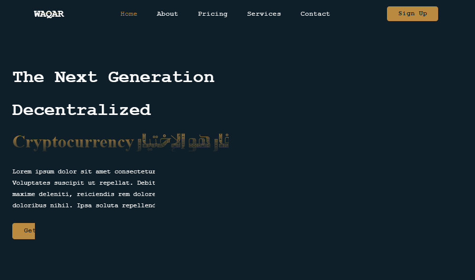
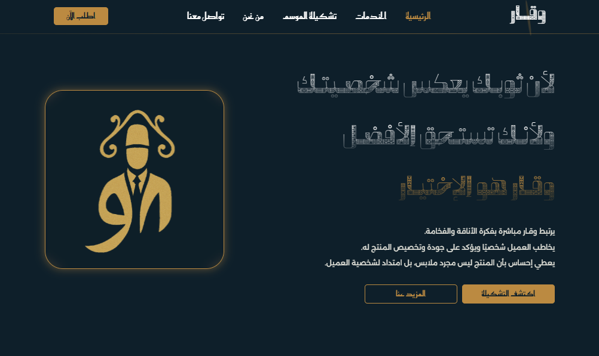
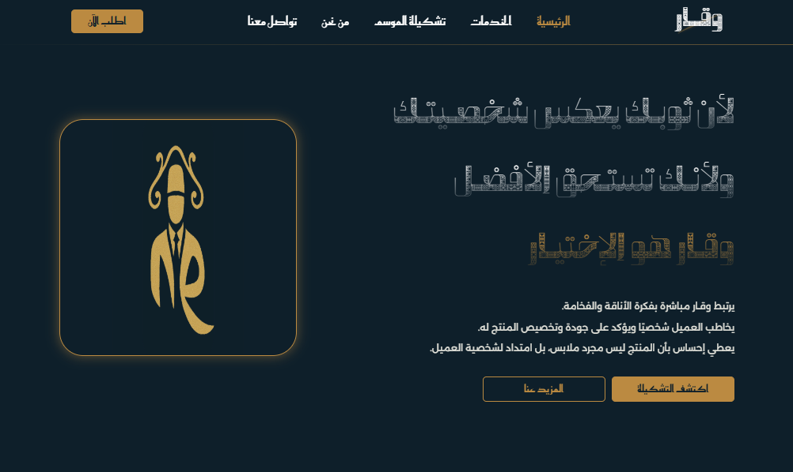
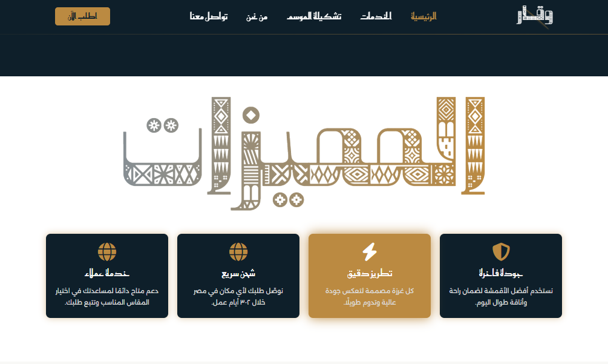
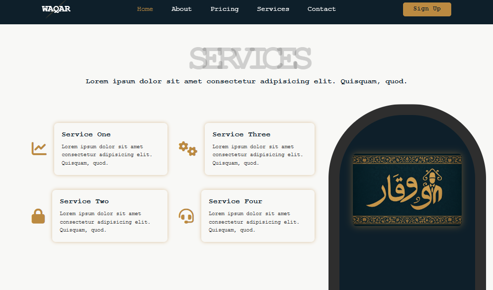
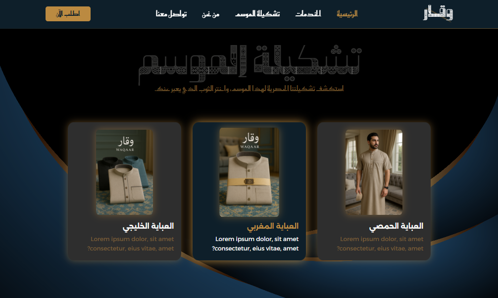
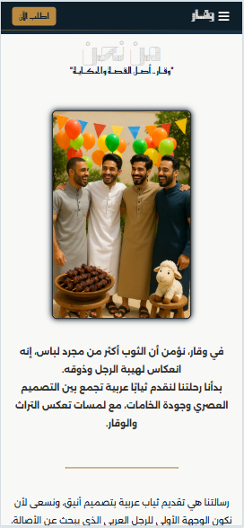
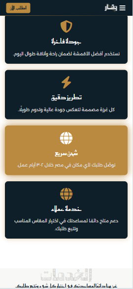

# WAQAR Thob Arabi 👕✨

A modern and elegant website showcasing the **WAQAR Thob Arabi** design.  
Built with **HTML + CSS only**, this project demonstrates responsive design, smooth transitions, animations, and a clean layout.


[](https://abood36.github.io/WAQAR-Thob-Arabi/)

---

## 🚀 Live Demo

👉 [View Website](https://abood36.github.io/WAQAR-Thob-Arabi/)

---

## ✨ Features

- Fully responsive design (works across all screen sizes).
- Smooth transitions and animations with delay effects.
- 3D rotation effect on hover with **pause/resume** interaction.
- Multiple sections: Landing, Features, Services, Portfolio, About Us.
- Optimized for **desktop and mobile viewports**.

---

## 📸 Screenshots

### 🖼 Landing Page (Initial Load)

**Image 1** – Shows the beginning of the website while it's loading, with transitions, text delay, and animations.  


### 🖼 Landing Page (Fully Loaded)

**Image 2** – The full landing section after load, displaying animations and design.  


### 🎥 3D Rotation Effect

**Image 3** – Demonstrates the Y-axis rotation effect. On hover, the animation **pauses** giving an interactive experience.  


### ⭐ Features Section

**Image 4** – A clear view of the **Features** section.  


### 🛠 Services Section

**Image 5** – Highlighting the **Services** section.  


### 🎨 Portfolio Section (Desktop)

**Image 6** – Showcasing the **Portfolio** section in desktop view.  


### 👥 About Us Section (Desktop)

**Image 7** – The **About Us** section in desktop layout.  


### 📱 About Us Section (Mobile)

**Image 8** – The **About Us** section in mobile view, showing responsive adaptability.  


### 📱 Portfolio Section (Mobile)

**Image 9** – The **Portfolio** section in mobile view, also fully responsive.  


---

## 🛠 How to Run Locally

1. Clone the repository:

   ```bash
   git clone https://github.com/abood36/WAQAR-Thob-Arabi.git

   ```

2. Navigate into the project folder:
   cd WAQAR-Thob-Arabi

---

## 📂 Project Structure

WAQAR-Thob-Arabi/
│── index.html
│── style.css
│── README.md
│── images/
│── fonts/
│── screenshots/
│ ├── 1.png
│ ├── 2.png
│ ├── 3.png
│ ├── 4.png
│ ├── 5.png
│ ├── 6.png
│ ├── 7.png
│ ├── 8.png
│ └── 9.png

---

## 🔮 Future Improvements

- Add a full Arabic version of the website for bilingual support.
- Integrate JavaScript for interactivity (e.g., dynamic navigation, animations, form handling).
- Improve SEO optimization for better search engine visibility.
- Enhance accessibility and performance.

---

## 👨‍💻 Author

Developed with ❤️ by abood36
